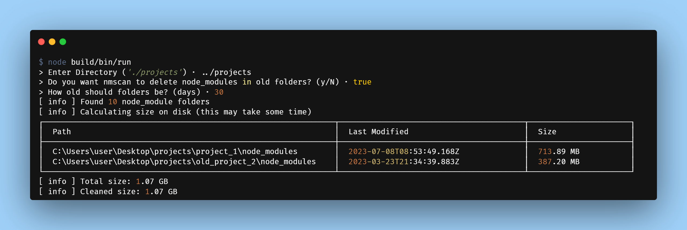

# nmscan

Scans relative directories for node_module folders and calculates total size



## Install

```sh
npm i @serversinc/nmscan -g
```

## Commands

#### Scan 

Scans the relative directory based on Current Working Directory for node_modules
```bash
nmscan
```